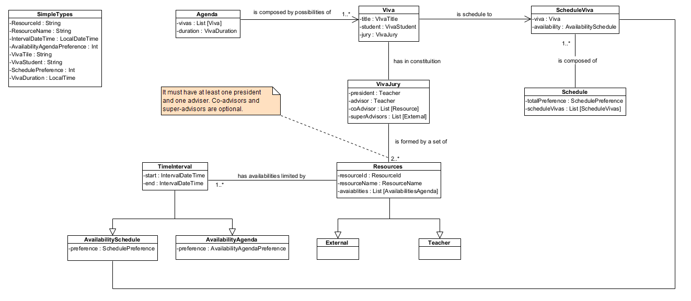
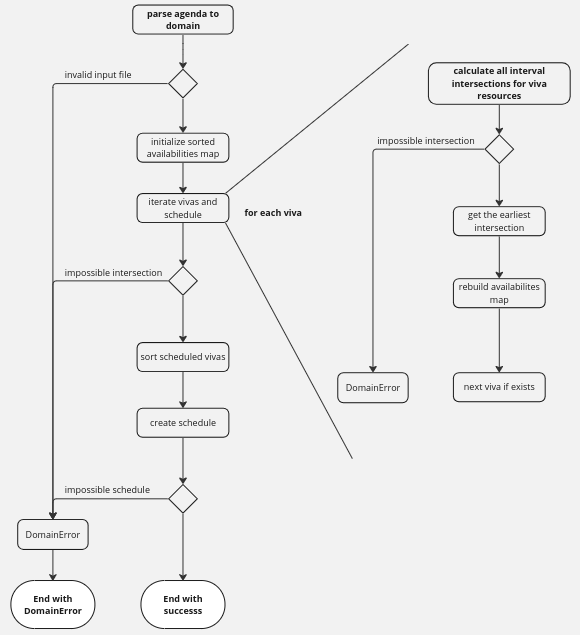
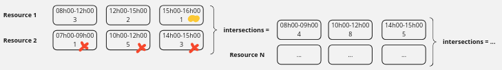
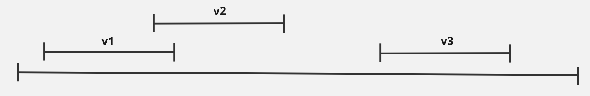
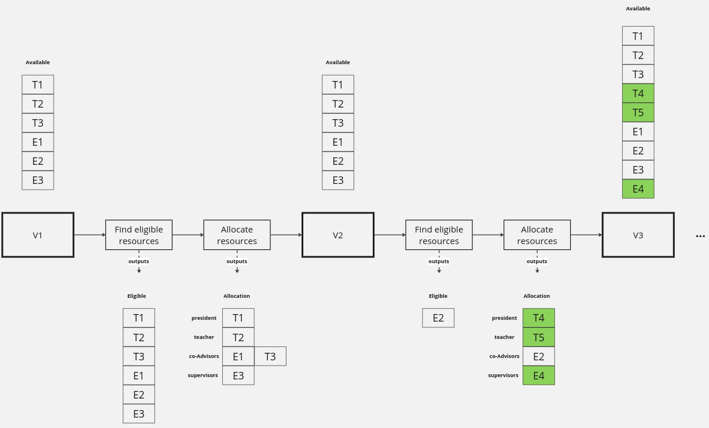
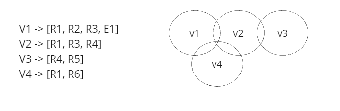
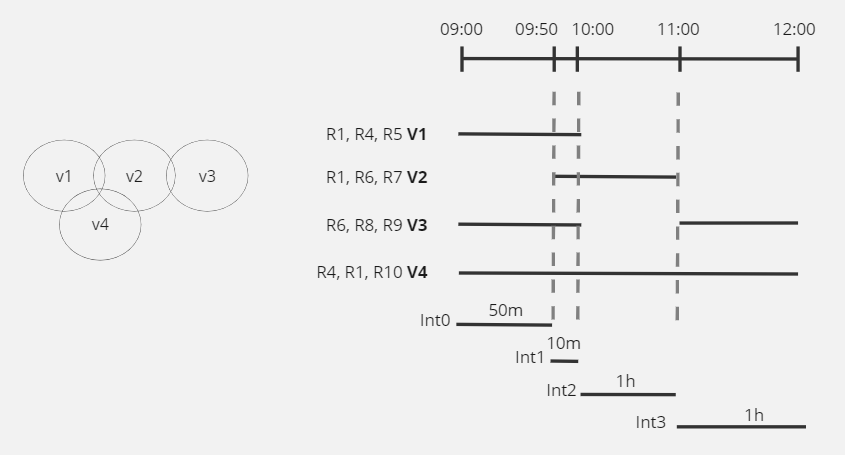
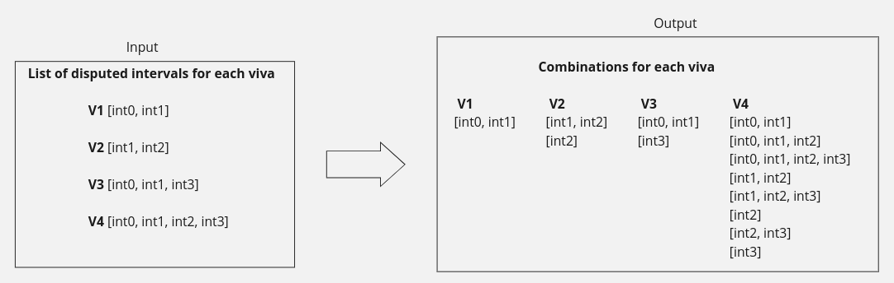
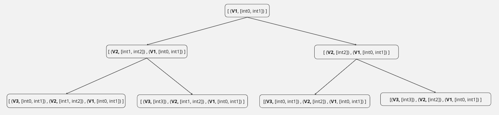
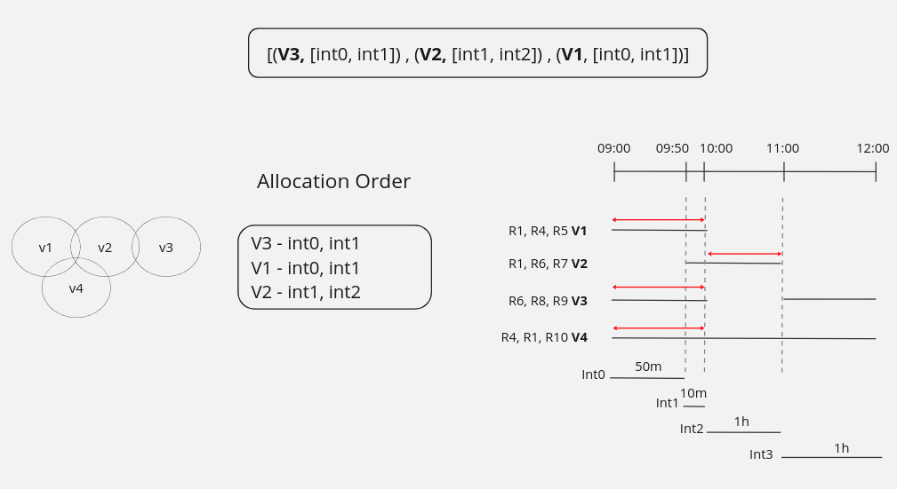

<h1> Vivas Schedule </h1>

**Team Members:**

-   Nuno Ribeiro
-   Rui Neto
-   Simão Santos

<h1> Index </h1>

- [1. Milestone 1](#1-milestone-1)
  - [1.1. Domain](#11-domain)
    - [1.1.1. Domain Constraints](#111-domain-constraints)
  - [1.2. Algorithm](#12-algorithm)
      - [1.2.0.1. Calculate all interval intersections for viva resources](#1201-calculate-all-interval-intersections-for-viva-resources)
  - [1.3. Tests](#13-tests)
    - [1.3.1. Tool used](#131-tool-used)
    - [1.3.2. Test cases and strategy](#132-test-cases-and-strategy)
      - [1.3.2.1. Unit Tests](#1321-unit-tests)
      - [1.3.2.2. Functional Tests](#1322-functional-tests)
    - [1.3.3. Tests results](#133-tests-results)
- [2. Milestone 2](#2-milestone-2)
  - [2.1. Approach](#21-approach)
  - [2.2. Generators](#22-generators)
    - [2.2.1. Resource allocation](#221-resource-allocation)
  - [2.3. Properties](#23-properties)
  - [2.4. Observations](#24-observations)
- [3. Milestone 3](#3-milestone-3)
  - [3.1. How the algorithm works](#31-how-the-algorithm-works)
    - [3.1.1. Dependent and independent vivas separation](#311-dependent-and-independent-vivas-separation)
    - [3.1.2. Find dependent vivas disputed intervals](#312-find-dependent-vivas-disputed-intervals)
    - [3.1.3. Intra-viva combinations](#313-intra-viva-combinations)
    - [3.1.4. Inter-viva combinations](#314-inter-viva-combinations)
      - [3.1.4.1. Combinations algorithm](#3141-combinations-algorithm)
      - [3.1.4.2. Validate combinations (tree nodes)](#3142-validate-combinations-tree-nodes)
    - [3.1.5. Choosing optimized allocation](#315-choosing-optimized-allocation)
  - [3.2. Tests](#32-tests)
    - [3.2.1. Test cases and strategy](#321-test-cases-and-strategy)
      - [3.2.1.1. Unit tests](#3211-unit-tests)
      - [3.2.1.2. Functional testing](#3212-functional-testing)
      - [3.2.1.3. Property based testing](#3213-property-based-testing)
      - [3.2.1.4. Improvements compared to MS01](#3214-improvements-compared-to-ms01)


# 1. Milestone 1

## 1.1. Domain

Given the problem, it was necessary to model the domain, in order to support all the operations needed for the viva scheduling, and to guarantee a correct creation of domain inside of all detected constraints. On the image bellow, is possible to see the domain diagram.



In order to guarantee the base properties to all domain, it was created simple types based on the opaque types. We used this kind of strategy to hide the real type to the outside, allowing only the operations defined by the extensions methods that we defined. Also, it constraints the creation to guarantee that all values created are inside the domain boundaries. With this in mind, it was created the following simple types:

-   **ResourceId**: Represents a resource ID, ensuring that all adhere to the domain pattern. The validation it was done by regex pattern.
-   **ResourceName**: Represents the resource name, ensuring that all created names are valid, i.e, not blank.
-   **IntervalDateTime**: Represents the date and time values used in the all domain logic.
-   **AvailabilityAgendaPreference**: Represents the preference used for the agenda (input file) of a Viva, where it only supports values from 1 to 5.
-   **VivaTitle**: Represents a valid title, i.e., not blank.
-   **VivaStudent**: It represents a student from Viva, however, we could treat a student as a class, but given that only the name appears in the domain, it was decided that it's enough to represent only the name.
-   **SchedulePreference**: Represents a schedule preference - a positive integer.
-   **VivaDuration**: Represents the duration of the Viva.

The domain diagram illustrates the creation of an abstraction within the resources to facilitate the detection of roles, rather than relying on a flag within the class, for example. This design decision reduces the responsibility for creating a `VivaJury`, as the incoming data is validated. Each resource is associated with a list of agenda availabilities, each with a preference ranking from 1 to 5, depending on the resource's choice.

These availabilities are represented through the `TimeInterval` abstraction, encapsulated within a Trait, making an Algebraic Data Types. The goal is to centralize all values related to time intervals. This allows service functions such as Allen's Algebra to utilize the logic within the Trait `Interval` and extend its applicability across all data types containing start and end times.

Additionally, this approach allows for centralized interval validation. By ensuring the base class's validation, so, other classes can accept it as a parameter and skip individual validation steps. This simplifies the process.

Both logics, are demonstrated in the snippet below.

```scala
sealed trait Interval:
  val start: IntervalDateTime
  val end: IntervalDateTime

final case class TimeInterval private(override val start: IntervalDateTime,
                                      override val end: IntervalDateTime) extends Interval

final case class AvailabilityAgenda(timeInterval: TimeInterval,
                                    preference: AvailabilityAgendaPreference) extends Interval:
  override val start: IntervalDateTime = timeInterval.start
  override val end: IntervalDateTime = timeInterval.end

final case class AvailabilitySchedule(timeInterval: TimeInterval,
                                      preference: SchedulePreference) extends Interval:
  override val start: IntervalDateTime = timeInterval.start
  override val end: IntervalDateTime = timeInterval.end

object TimeInterval:
  def from(start: IntervalDateTime, end: IntervalDateTime): Result[TimeInterval] =
    if (start.isBefore(end)) Right(TimeInterval(start, end))
    else Left(InvalidTimeInterval("start datetime not before end datetime"))
```

In the remainder of the domain, it is noticeable that a `Viva` will contain a `VivaJury`, which must consist of at least two resources: a president and an advisor. Additionally, a `Viva` can be allocated to an `Agenda`, which serves as the input, or to be part of an validated schedule, which serves as the output.

For the output, it's necessary to aggregate all the preferences for each `Viva` individually, as well as across all documents

### 1.1.1. Domain Constraints

A crucial step in the construction of domain is to guarantee that all domain created is correct. With this in mind, smart constructors were used whenever there is a possibility of error of creating the class, given the input parameter.

The logic mentioned earlier is demonstrated in the snippet below. Here, a companion object receives the parameters and creates the value, where it can be either a valid value or a domain error. Meanwhile, the `VivaJury` constructor is private to ensure that all constructions of juries came from the smart constructor.


```scala
final case class VivaJury private(president: Teacher,
                                  advisor: Teacher,
                                  coAdvisors: List[Resource],
                                  supervisors: List[External])

object VivaJury:

  def from(president: Teacher, advisor: Teacher, coAdvisors: List[Resource], supervisors: List[External]): Result[VivaJury] =
    if (hasDuplicates(president :: advisor :: coAdvisors ::: supervisors))
      Left(InvalidVivaJuryConstitution("there is duplicates of resources on the different positions of the jury viva"))
    else
      Right(VivaJury(president, advisor, coAdvisors, supervisors))
```

After a brief explanation of how we try to apply security to the domain, some of the constraints used will be presented. It's important to note that before it was described the SimpleTypes validation, which will be ignored for this purpose:

<table>
  <thead>
    <tr>
      <th>Class</th>
      <th>Validations</th>
    </tr>
  </thead>
  <tbody>
    <tr>
      <td>VivaJury</td>
      <td>Cannot have duplicated resources. Here the comparison is based on the ResourceId, and not based on reference</td>
    </tr>
    <tr>
      <td>TimeInterval</td>
      <td>The start it must be before of the end time</td>
    </tr>
    <tr>
      <td>Resources</td>
      <td>It cannot have overlap availabilities, e.g, a resource that as a availability of (10h00-11h00) cannot have another of (10h30-11h15). Also, it cannot have a empty availabilities list</td>
    </tr>
      <tr>
      <td>Schedule Viva</td>
      <td>Cannot have a empty list of Vivas</td>
    </tr>
    </tr>
      <tr>
      <td>Agenda</td>
      <td>Cannot have a empty list of Vivas. Cannot have more than 1 viva per student. Vivas cannot have duplicated titles.</td>
    </tr>
  </tbody>
</table>

## 1.2. Algorithm

The algorithm aims to schedule vivas using a First Come, First Served approach, which means scheduling each viva for the
earliest available time when all its required resources are free. Success means scheduling all vivas, while failure means
some vivas couldn't be scheduled due to resource unavailability.

An important aspect of this algorithm is to remember that scheduling a viva makes the corresponding time interval become
unavailable for its resources. To manage this logic, we utilize a hashmap where the ResourceId serves as the key, and
the list of availabilities serves as the value. Whenever a new viva is scheduled, the hashmap is rebuilt to reflect the
revised availabilities.

The next image shows a graphical representation of the algorithm.



#### 1.2.0.1. Calculate all interval intersections for viva resources

In this phase of the algorithm, it is assumed that all resource availabilities are sorted. We begin by selecting two
members from the viva jury and proceed to compute all potential intervals where the viva duration can be accommodated.
These intervals are determined by identifying intersections between the chosen jury's schedules. Next, we compare these
resulting intersections with the availabilities of another member of the viva jury, repeating the process until all jury
members' availabilities have been considered.

To mitigate the excessive number of comparisons between availabilities, the algorithm incorporates the following
efficiency rules:

-   Given that availabilities are ordered, if we compare availability A1 with B1 and find that B1 **ends before**, **at
    the same time as**, **or after a period of time during which the viva duration doesn't fit**, we can infer that B1
    will never intersect with A2 (the availability following A1 on the list).
-   Given the ordered nature of availabilities, when comparing availability A1 with B1, if B1 **ends after**,
    **at the same the time as**, **or before a period of time during which the viva duration doesn't fit**, we can infer
    that A1 will never intersect with B2 (the availability following B1 on the list).
-   When comparing with the availabilities of the last resource, the algorithm halts its search for further
    intersections upon finding the first one.

Additionally, the calculation of preferences occurs dynamically during this process. Whenever two availabilities are
intersected, the resulting availability inherits a preference equal to the sum of the preferences from the source
availabilities.

To help you grasp this important part of the algorithm, the images below show a step-by-step process for calculating
possible viva schedule intervals. Keep in mind that the **vivas duration is 1h**.

On the following image, the availabilities of two resources are shown. We start by comparing the earliest availability of
Resource 1 (highlighted in yellow) with the availabilities of Resource 2, also starting with its earliest slot
(marked in blue). The resulting intersection is depicted in green.


Before proceeding to evaluate the next availability of Resource 2, we halt consideration of the initial availability
from Resource 2, as it couldn't intersect with any subsequent availabilities of Resource 1.
Following this, we advance the blue pointer to the next availability from Resource 2 and conduct the intersection,
resulting in the intersection show in green.


At this point, given that the current availability from Resource 1 does not
intersect with any subsequent availabilities from Resource 2, we proceed by shifting the yellow pointer to the next
availability. By repeating the same logic of the last images we produce a new intersection.


Finally, we acquire all the possible availability intersections between the two resources. Subsequently, we iterate this
process by comparing these resultant intersections with the availabilities of the subsequent viva jury resource.




## 1.3. Tests

In Scala, a language that supports functional programming, testing takes on a particularly significant role **due to its rich type system**.

Scala's type system is robust and helped us prevent many common programming errors at compile time. However, the type system alone **didn't guarantee the correctness of business logic** or runtime behaviors such as overlapping availabilities or repeated student IDs. Testing (unit tests and functional tests) ensured that the application behaved as expected, catching domain errors that the type system couldn't.

After testing the XML parsing, the FCFS algorithm's logic for scheduling, and the generation of output XML, we noticed that all functioned as expected. Tests were key to built a reliable system.

### 1.3.1. Tool used

To test our work, we used `org.scalatest`. ScalaTest is the most flexible and most popular testing tool in the Scala ecosystem. By offering deep integration with tools such as sbt, ScalaTest made it easy to take our testing to a more productive level.

Example on how we used Scala Test:

```scala
class SimpleTypesTest extends AnyFunSuiteLike:
  test("Valid resource ID for teacher"):
    val resourceId = ResourceId.from("T001")
    assert(resourceId.fold(_ => false, _ => true))
```

### 1.3.2. Test cases and strategy

In our project, we opted to heavily focus on unit testing and some functional testing. Unit testing helped us along all the project development to verify if the domain classes and objects were actual reliable to use in our algorithm. Functional tests were helpful to compare an input XML with the expected output.

#### 1.3.2.1. Unit Tests

Unit tests form the backbone of our project's validation strategy, ensuring each class, object, simple type, and service operates as expected across a variety of scenarios. These tests are meticulously designed against predefined criteria **to guarantee that every component functions correctly**.

The unit tests for our project are organized within the directory `src/test/scala/pj/domain`. The table below provides a detailed summary of these tests, showcasing the rigor and successful outcomes of our efforts:

| Entity               | Tests Done | Successful Tests | Status         |
| -------------------- | ---------- | ---------------- | -------------- |
| IntervalAlgebraTests | 34         | 34               | All Passed     |
| IntervalServiceTests | 7          | 7                | All Passed     |
| ListServiceTest      | 9          | 9                | All Passed     |
| ScheduleServiceTest  | 5          | 5                | All Passed     |
| VivaServiceTest      | 6          | 6                | All Passed     |
| XMLToDomainTest      | 4          | 4                | All Passed     |
| DomainToXMLTest      | 2          | 2                | All Passed     |
| TeacherResourceTest  | 6          | 6                | All Passed     |
| ExternalResourceTest | 6          | 6                | All Passed     |
| VivaTest             | 5          | 5                | All Passed     |
| ScheduleVivaTest     | 1          | 1                | All Passed     |
| SimpleTypesTest      | 25         | 25               | All Passed     |
| TimeIntervalTest     | 5          | 5                | All Passed     |
| VivaJuryTest         | 7          | 7                | All Passed     |
| **Total**            | **122**    | **122**          | **All Passed** |

#### 1.3.2.2. Functional Tests

To further validate our algorithm, functional tests were conducted using XML inputs and outputs. These tests were aimed at replicating "real-world" usage to ensure the algorithm not only works theoretically **but also performs under unknown operational conditions**. The tests and their corresponding XML files are located in `files/test/ms01` and `src/test/scala/pj/domain/schedule/ScheduleMS01Test.scala`, respectively.

| Entity           | Tests Done | Successful Tests | Status         |
| ---------------- | ---------- | ---------------- | -------------- |
| ScheduleMS01Test | 6          | 6                | All Passed     |
| **Total**        | **6**      | **6**            | **All Passed** |

### 1.3.3. Tests results

During the course of developing the vivas scheduling project, we encountered and resolved several bugs, thanks to our rigorous testing regime. Despite these challenges, **all 128 tests conducted across both unit and functional testing phases were successful**. This flawless execution of tests not only reaffirms the reliability of our domain but also validates the effectiveness of our scheduling algorithm.


# 2. Milestone 2

## 2.1. Approach

For our Property-based tests, we chose a **Bottom-up** approach, emphasizing a "component-centric" strategy. This method prioritizes generating and testing individual components before incorporating them into larger structures. By focusing on each component independently, we could swiftly detect defects in object creation and logic, enabling timely corrections before integration into more complex tests.

We began by testing the `SimpleTypes`, as they constitute the least complex components of our algorithm. Once we verified the soundness of these basic elements, we progressed to develop generators and properties for the components that rely on them. This incremental approach continued until we successfully generated and tested **the creation a complete agenda**. This systematic process ensured not only the functionality of our algorithm but also the clarity and precision of each component, from the most elementary to the most intricate.

## 2.2. Generators

> [!NOTE]
> All the following generators make use of the `transformResultIntoGen` function. This function is responsible to convert a Result[T] into a Gen[T] when we create an instance using its smart constructor.

**_genResourceId_**

This generator generates a new `ResourceId` that is unique among a given list of existing ResourceIds. It takes two parameters: isTeacher, a Boolean indicating if the resource is for a Teacher or External, and `rids`, a list of existing ResourceIds.

The function starts by setting a prefix based on the `isTeacher`. It then generates all possible IDs within a predefined range (`RESOURCE_ID_MIN` to `RESOURCE_ID_MAX`). These generated IDs are converted to `ResourceId` objects using `ResourceId.from` and collected into `allPossibleIds`.

Next, it filters out any IDs that are already present in the provided list `rids`, resulting in `remainingIds`, which are the potential new ResourceIds that do not conflict with existing ones. Finally, the function uses a generator to randomly select one `ResourceId` from the `remainingIds`.

**_genResourceName_**

This generator generates a random `ResourceName`. It starts by choosing a random length for the name within a specified range (`RESOURCE_NAME_LENGTH_MIN` to `RESOURCE_NAME_LENGTH_MAX`). Then, it generates a list of lowercase alphabetic characters of that length.

**_getAvailabilityAgendaPreference_**

This generator generates an `AvailabilityAgendaPreference` by first selecting a random preference value within a specified range (`AVAILABILITY_AGENDA_PREFERENCE_MIN` to `AVAILABILITY_AGENDA_PREFERENCE_MAX`). Then, it uses a conversion function to transform this value into an AvailabilityAgendaPreference object, handling any potential domain errors.

**_genVivaTitle_**

This generator generates a new `VivaTitle` that is unique among a given list of existing VivaTitles. It starts by generating all possible titles within a predefined range (`VIVA_TITLE_NUM_MIN` to `VIVA_TITLE_NUM_MAX`). These generated titles are converted to `VivaTitle` objects using `VivaTitle.from` and collected into `allPossibleTitles`.

Next, it filters out any titles that are already present in the provided list `vtl`, resulting in `remainingTitles`, which are the potential new VivaTitles that do not conflict with existing ones. Finally, it uses a generator to randomly select one `VivaTitle` from the `remainingTitles`.

**_genVivaStudent_**

This generator generates a new `VivaStudent` that is unique among a given list of existing VivaStudents. It starts by generating all possible students within a predefined range (`VIVA_STUDENT_NUM_MIN` to `VIVA_STUDENT_NUM_MAX`). These generated students are converted to `VivaStudent` objects using `VivaStudent.from` and collected into `allPossibleStudents`.

Next, it filters out any students that are already present in the provided list `vsl`, resulting in `remainingStudents`, which are the potential new VivaStudents that do not conflict with existing ones. Finally, it uses a generator to randomly select one `VivaStudent` from the `remainingStudents`.

**_genDuration_**

This generator generates a `VivaDuration`, representing the duration of a viva session. It does so by randomly selecting values for hours, minutes, and seconds within their respective valid ranges (0-23 for hours, 0-59 for minutes and seconds). However, if both hours and minutes are zero, it ensures that the seconds are between 1 and 59 **to avoid a duration of zero**. The selected values are then formatted into a string representing the duration (`hh:mm:ss`), and finally transformed into a VivaDuration object.

**_genDurationWithCeiling_**

This generator generates a `VivaDuration` with a ceiling limit specified by the received parameter. It starts by determining the maximum possible duration in seconds based on the ceiling. Then, it randomly selects values for hours, minutes, and seconds within their respective valid ranges, **ensuring that the total duration does not exceed the ceiling**. The selected values are then formatted into a string representing the duration (`hh:mm:ss`) and transformed into a `VivaDuration` object.

**_getAvailabilityAgendaPreference_**

This generator is responsible to generates a valid `AvailabilityAgendaPreference`. For that, it will generate a random value that obeys to the range (`AVAILABILITY_AGENDA_PREFERENCE_MIN`, `AVAILABILITY_AGENDA_PREFERENCE_MAX`) limits and it creates the type which is granted to be correct in terms of domain rules.

**_genGlobalIntervalTime_**

This is the generator responsible to generate a valid global time, in other words, a random interval with a random duration. In order to do that, it begins with generating a duration with a random value. After that, it chooses a random `LocalDateTime` as the start of the interval, where the range are (`LocalDateTime.MIN.toEpochSecond(ZoneOffset.UTC)`, `LocalDateTime.MAX.toEpochSecond(ZoneOffset.UTC) - duration.toSeconds`). The end is then determined by adding to the start `LocalDateTime` the duration value.

Although, there is a specification of this generator, where it takes a duration as parameter and the task is only to choose a random interval with the given duration.

**_genVivaIntervalTimeOf_**

This generator takes as parameter one `TimeInterval` and a `duration`, and is tasked to generate a random `TimeInterval` that respects the limit of the interval, being inside, as also the duration given. The objective of this generator is to generate a random `TimeInterval` that it will be associated to a agenda viva, complying with the rules imposed.

**_genAvailabilities_**

The objective of this generator is to take as parameters a list of `TimeIntervals` and with that generate a list of `AvailabilityAgenda`. This last type requires a preference associated with a `TimeInterval`. So, this generator it will generate a list with the exact number of the intervals received of `AvailabilityAgendaPreference` and it will do "pairs" of it creating the new type.

**_genIntervalsNotOverlapped_**

This is a generator that is focuses on generating a list of random `TimeIntervals` that don't overlap with the given list of `TimeIntervals`, as well as the new ones that are being created. So, the goal behind this generator, is to generate an extra N number of intervals that are limited by the range(`EXTRA_AVAILABILITIES_MIN`, `EXTRA_AVAILABILITIES_MAX`) that it will be added to the availabilities of the resource. To ensure consistency within the intervals, we only append a `TimeInterval` to the return list if it doesn't overlap with existing intervals. Consequently, the result may be an empty list, which is considered preferable to risking an infinite loop in cases where the limits are too tight and the probability of having interceptions are higher.

**_genRandomlyLargerIntervals_**

This generator aims to take a TimeInterval and tries to extend it in a random manner, to avoid always associating the viva schedule with the exact value of availability and to create more "valid randomness". The logic is that the resource must have availability from one time to another, and here we try to add more time on the sides, always comparing with the existing list of already scheduled intervals to avoid overlapping.

**_genExternal and genTeacher_**

With the necessity of creating resources it was created a generator of `Teachers` and `Externals`. This is a more complex generator in order that uses another generators, like : `genResourceId`, `genResourceName`, `genAvailabilities`, `generateIntervalsNotOverlapped`. With the result of each inner generator it's possible to generate a resource type.

### 2.2.1. Resource allocation

The validity of vivas depends on the availability of at least one interval where all necessary resources can be accessed
for the duration of the viva. Each viva necessitates such an interval, making it crucial that intervals intersecting with
those of other vivas can't share resources; after all, one individual cannot be present in two vivas simultaneously. By
ensuring these conditions are met, we can confidently assert the validity of the set of vivas for a given agenda,
guaranteeing the presence of at least one suitable interval for each viva for scheduling.

The purpose of resource allocation is to generate a valid distribution of resources for a predefined set of intervals
during which the vivas will take place, adhering to the conditions stated above. Initially, we determine the number of
vivas for a given agenda. Subsequently, we create an equal number of time intervals within a global interval. These
intervals signify the predetermined time slots for which each viva will occur.

For instance, if we were tasked with scheduling 3 vivas, a potential arrangement of intervals might resemble the following
(see image below). Each interval corresponds to the time slot designated for each viva:



Once we have established the intervals for each viva (v1, v2, and v3), we need to allocate a set of resources ensuring
that the resources allocated to v1 and v2 do not overlap due to their intersecting time intervals. Conversely, since the
time interval for v3 does not intersect with those of the other vivas, we have the flexibility to allocate its resources
without constraints.

The algorithm illustrated in the following image facilitates valid resource allocation within predefined viva intervals. It
initiates by generating a resource list adhering to certain criteria, such as ensuring a minimum number of teachers and
externals. Subsequently, it iterates through each interval, computing the list of eligible resources for that interval.
These eligible resources encompass those not already assigned to intersecting intervals. If this list proves insufficient
to form a viva jury, for instance, lacking at least two teachers, the algorithm dynamically generates new resources to
supplement the available pool, maintaining validity. Finally, the resources are allocated to the viva, and the algorithm
proceeds to the next interval.



Allocating resources essentially involves assigning each resource a single availability slot, which corresponds to the time
when the viva will take place. Following allocation, we generate additional availabilities, ensuring they do not intersect with each other. This process guarantees the validity of the resource allocation, as each resource possesses at least one
availability slot that aligns with the viva's scheduling requirements.

## 2.3. Properties

**_Generated ResourceId must not exist in the list of existing ResourceIds_**

This property verifies that when the `genResourceId` function is called, the generated `ResourceId` does not exist in a list of existing IDs. It starts by generating a list of Int from 1 to `NUMBER_OF_RESOURCES_TO_GENERATE` and converting them into `ResourceId` objects.

Then, it verifies that for all generated ResourceIds using `genResourceId`, none of them exist in the existing list. This ensures that the generated ResourceIds are unique within a provided list.

**_ResourceName must be valid_**

This property ensures that the generated `ResourceName` instances are valid, meaning their lengths fall within the specified range. It utilizes the `genResourceName` generator to produce random `ResourceName` instances. Then, it verifies that the length of each generated `ResourceName` falls within the acceptable range defined by `RESOURCE_NAME_LENGTH_MIN` and `RESOURCE_NAME_LENGTH_MAX`.

**_AvailabilityAgendaPreference must be valid_**

This property ensures the validity of generated `AvailabilityAgendaPreference` instances by verifying that their integer representations fall within the specified range. It utilizes the `getAvailabilityAgendaPreference` generator to produce random `AvailabilityAgendaPreference` instances. Then, it checks whether the integer representation of each generated preference (`aap.toString.toInt`) is within the acceptable range defined by `AVAILABILITY_AGENDA_PREFERENCE_MIN` and `AVAILABILITY_AGENDA_PREFERENCE_MAX`.

**_Generated VivaTitle must not exist in the list of existing VivaTitles_**

This property verifies that when the `genVivaTitle` function is called, the generated `VivaTitle` does not exist in a list of existing titles. It starts by generating a list of Int from 1 to `NUMBER_OF_VIVA_TITLES_TO_GENERATE` and converting them into `VivaTitle` objects.

Then, it verifies that for all generated VivaTitles using `genVivaTitle`, none of them exist in the existing list. This ensures that the generated VivaTitles are unique within a provided list.

**_Generated VivaStudent must not exist in the list of existing VivaStudents_**

This property verifies that when the `genVivaStudent` function is called, the generated `VivaStudent` does not exist in a list of existing students. It starts by generating a list of Int from 1 to `NUMBER_OF_VIVA_STUDENTS_TO_GENERATE` and converting them into `VivaStudent` objects.

Then, it verifies that for all generated VivaStudents using `genVivaStudent`, none of them exist in the existing list. This ensures that the generated VivaStudents are unique within a provided list.

**_VivaDuration with ceiling must be less than or equal to VivaDuration_**

This property ensures that a `VivaDuration` instance generated with a ceiling is less than or equal to the passed by parameter `VivaDuration`.

It begins by generating an instance of `VivaDuration` and a `VivaDuration` with ceiling passing the first one by parameter. Then, it checks whether the duration represented by `duration` is greater than or equal to the duration represented by `durationWithCeiling`. This comparison is done based on the total number of seconds in each duration.

**_External must have the obligate availabilities plus some extras (if case) and cannot overlap_**

The goal of this property is to guarantee that all generated `Resources` are correct. This means to enure that the generated resource is consistent with having the given number of availabilities passed as parameter and also having some extras if applicable. However, it can happen that the extra availabilities are missing due to the internal logic of the generator, so the comparison is `obligateAvailabilities <= newTotalAvailabilities` to validates all cases. Also, all availabilities, mandatory and extra, cannot overlap.

**_Availabilities are generated respecting the time intervals given_**

The objective of this property is to ensure that all the `Availabilities` are generated respecting the limits of the `TimeInterval` given. For that, it's generated a random interval first, and with that interval is called the generator that creates one `Availability` within the interval passed as parameter. With the result is verified that the list of generated intervals are really respecting the limits.

**_Vivas time intervals are correctly generated respecting the limits of the time interval given_**

This property ensures that the `TimeIntervals` generated by the generator adhere to both the specified duration and the interval constraints given as parameters, ensuring that the generated interval is within the specified limits.

**_Size of allocated resources must be equal to the num of required resources_**

The goal of this property is to ensure that `ResourcesAllocation` satisfies the amount of resources to allocate.

**_Size of generated (extra) resources must be greater or equal than the difference between the required and eligible_**

During resource allocation, there is a possibility that the available pool may not fully meet the required amount of
resources. In such cases, additional resources may be generated during the allocation process. The goal of this property
is to verify if the actual number of generated resources is equal to the expected number of generated resources, which is
the difference between the required and eligible.

**_Generated (extra) resources indexes must be the subsequent to the available resources indexes_**

This property ensures that newly generated resources are assigned sequential indexes following the existing resources. For
instance, if initially only resources T1 and T2 are available, subsequent resources would be indexed as T3, T4, and so forth.

**_Overlapping intervals cannot have coincident resources_**

When scheduling resources for different intervals, it's crucial to ensure that resources assigned to overlapping intervals
do not coincide. This prevents conflicts where a single resource is expected to serve multiple intervals simultaneously,
which would lead to an invalid agenda.

**_Non repetition of resources within a single interval_**

Given that one element of the jury can only occupy one role, this property ensures that the generated allocation does not
contain duplicated resources.

**_Each schedule viva's info must always be equals to each corresponding agenda viva's info_**

This property is focused on verifying that the scheduled vivas given by the execution of the algorithm over a agenda randomly generated contains the correct viva's information. In order to do this verification, it's necessary to match the schedule viva with the agenda viva by the title, given that they must be unique in all vivas. With the correspondence made, it's compared if the `StudentName` is the same, also if the `VivaJury` has the exact same resources and in the same roles.

**_The number of scheduled vivas must be equals to the agenda's vivas_**

This property is focused on the result of the algorithm's execution, where the scope is to ensure that the number of vivas is not alter during the execution.

**_Schedule total preference must always be equals to the sum of all agenda viva's resource's preference_**

This property ensures that after running the algorithm, the `TotalSchedulePreference` reflects the sum of the `AgendaPreference` values of all resources in the viva agenda. To achieve this, we compare each scheduled viva with its corresponding agenda viva. Then, it's analyzed the resource availabilities to identify the intersecting one with the scheduled viva's interval and sum the value values.

**_Schedule total preference must always be equals to the sum of each scheduled viva's preference_**

In complement with the property cited before _"Schedule total preference must always be equals to the sum of all agenda viva's resource's preference"_, is necessary to guarantee that the sum of the already schedule viva's preferences generated complies with the total preference.

**_Each viva's schedule duration is equal to the agenda's viva duration_**

This is also a property that is ran against a result given by the execution of the algorithm, and is fundamental to ensure that all scheduled viva's `TimeInterval` has the duration of the agenda's viva duration registered on the input.

**_The schedule's vivas resource cannot overlap with another schedule viva_**

This property aims to guarantee that the output produced by the algorithm supports a valid schedule. In other words, we need to ensure that there aren't any viva's that overlaps in time that share common resources

## 2.4. Observations

Currently, it's difficult to ensure that all properties focused on evaluating the correctness of the scheduling algorithm execution are met. This is due to the agenda generator producing valid agendas that don't necessarily adhere to a First Come First Serve (FCFS) order. So, considering that the MS1 algorithm doesn't cover all edge cases, and is focused on a FCFS order, for a large number of tests it fails, and is not possible to know how much attempts passed or failed. This is because of the characteristics of ScalaCheck that interrupts the property test at the first failure.

However, to verify this, a temporary property, shown bellow, it was implemented to print whether the scheduling was generated correctly or not. The results suggest that the majority of the agendas are indeed correctly scheduled. Nevertheless, with the implementation of MS3 algorithm it's expected that all properties pass.

```scala

  property("Temporary property") =
    forAll(genAgenda):
      agenda => {
        execScheduleMS01(agenda) match
          case Right(_) => println("It passed!")
          case Left(e) => println(s"Error! Cause: e")
        true
      }
```


Also, for a more interactive and maintainable way to adjust the range of the generators/properties it was created constants at the begin of the files, like shown bellow:

```scala
  val RESOURCE_ID_MIN = 1
  val RESOURCE_ID_MAX = 999
  val RESOURCE_NAME_LENGTH_MIN = 3
  val RESOURCE_NAME_LENGTH_MAX = 15
  val AVAILABILITY_AGENDA_PREFERENCE_MIN = 1
  val AVAILABILITY_AGENDA_PREFERENCE_MAX = 5
  ...
  val TEACHERS_PER_VIVA_MAX = 5
  val EXTERNALS_PER_VIVA_MIN = 1
  val EXTERNALS_PER_VIVA_MAX = 4
  val AGENDA_TEACHERS_MIN = 2
  val AGENDA_TEACHERS_MAX = 8
  val EXTRA_AVAILABILITIES_MIN = 1
  val EXTRA_AVAILABILITIES_MAX = 5
```


# 3. Milestone 3

For this milestone, the requirement was to develop a new algorithm that is more effective is terms of achieving the scheduled vivas **with a higher total preference value**.

The main idea was to repeat the process of developing a scheduler algorithm, but instead of a _First Come First Served_ approach, the algorithm to be developed would have to be **the most effective possible in terms of maximizing the preferences of the resources availabilities**.

## 3.1. How the algorithm works

### 3.1.1. Dependent and independent vivas separation

The primary step is to divide the vivas into groups to optimize the calculation. It is straightforward to allocate the best time for independent vivas, as we only need to identify the possible intervals and choose the one with the highest preference, given that there are no dependencies. However, it is crucial to group vivas with dependencies together. For these dependent groups, we cannot determine the optimal allocation in isolation, instead, we need to consider the group as a whole.

A group is formed if there are direct dependencies, e.g., VivaA and VivaB both requiring Resource1. Additionally, indirect dependencies are also considered, e.g., if VivaA has a direct dependency with VivaB, and VivaB has a direct dependency with VivaC, even though VivaA does not have a direct dependency with VivaC, all three vivas would be grouped together.

The logic behind this is to iterate over all vivas and identify those with direct dependencies. After identifying these dependencies, we merge the groups of directly dependent vivas into one group, which includes the viva that is being iterated itself.

Analyzing the image below, we can see the vivas information represented on the left. We observe that V1 has a direct dependency with V2 through R1 and R2, and with V4 through R1. Additionally, V2 and V4 have a direct dependency through R1. Finally, V3 has a dependency with V2 through R4. Therefore, given this input of vivas, we have one group, as all of them have direct or indirect dependencies.




### 3.1.2. Find dependent vivas disputed intervals

The second part of the algorithm aims to determine overlapping time intervals **for a list of dependent Vivas**. Each `Viva` is associated with a list of possible time intervals. Next, we present a detailed breakdown of the function and its inner workings:

We start by iterating through the `vivasWithIntervals` list. For each Viva, we iterate through its `timeIntervals`. Then, all unique start and end times from these intervals are collected into a Set. After that, we convert the set of times to a list, sort it and use the sorted times **to create pairs of start and end times**.

The inner function `findIntervalsBasedOnTimesThatMatchesViva` filters intervals to find those that are "inner" intervals within any of the `vivaIntervals`.

The final output is a list of tuples, each containing a Viva and the list of disputed intervals for that Viva.

**Example:**



In this example, we find that V1, V2, V3, and V4 all share some resources, so they are treated as a group. After we define the group, we then need to find the "inner" intervals that are composed by the `starts` and `ends` of the viva's availabilities.

Finally, we have a `List` of tuples composed by `(Viva, List(TimeInterval))`, as shown below:

```java
List(
  (V1, List(int0, int1)),
  (V2, List(int1, int2)),
  (V3, List(int0, int1, int3)),
  (V4, List(int0, int1, int2, int3))
)
```


More specifically:

```java
List(
  (V1, List("09:00-09:50", "09:50-10:00")),
  (V2, List("09:50-10:00", "10:00-11:00")),
  (V3, List("09:00-09:50", "09:50-10:00", "11:00-12:00")),
  (V4, List("09:00-09:50", "09:50-10:00", "10:00-11:00", "11:00-12:00"))
)
```

The next step of the algorithm is to find the *intra-viva combinations* **for each viva**.

### 3.1.3. Intra-viva combinations

After identifying the disputed intervals for each viva, the next step in the algorithm is to generate valid combinations 
of these intervals. A combination is considered valid if the intervals form a continuous block and the total duration meets 
or exceeds the minimum required duration for the viva. Referring to the provided image, the input consists of a list of 
disputed intervals for each viva. For example, V1 has intervals **[int0,int1]**, V2 has intervals **[int1,int2]**, V3 has intervals
**[int0,int1,int3]**, and V4 has intervals **[int0,int1,int2,int3]**. The output involves generating combinations for each viva 
such that they form continuous intervals and satisfy the minimum duration requirement. For instance, the valid combinations 
for V1 are **[int0,int1]**, for V2 they are **[int1,int2]**, and for V3 they include **[int0,int1]** and **[int3]**. V4 
has a more complex set of combinations such as **[int0,int1]**, **[int0,int1,int2]**,  **[int0,int1,int2,int3]**, 
**[int1,int2]**, **[int1,int2,int3]**, **[int2]**, **[int2,int3]**, and **[int3]**.



The next phase of the algorithm focuses on combining each combination of intervals from one viva with the combinations 
from the other vivas. 

### 3.1.4. Inter-viva combinations

#### 3.1.4.1. Combinations algorithm

As previously explained, this phase of the algorithm focuses on combining each intra-viva combination to create all possible 
scheduling options. To achieve this, we construct trees where each node accumulates combinations from the previous one until 
reaching the leaves, where complete schedule options are located. Using the following image as an example, the tree structure starts with initial combinations and expands by adding combinations 
from other vivas at each level. This process continues until the leaves, representing fully formed schedules, are reached.



However, calculating all possible schedule options can lead to a combinatorial explosion, making it unrealistic to explore 
every possibility. To manage this, each node is validated as the tree is built. If a node is deemed invalid, that path is not 
considered further. Despite this, validating each node in large trees with thousands of nodes can be computationally expensive. 
Therefore, not only are invalid nodes excluded, but some valid ones are also pruned to reduce the search space.
This pruning strategy, while effective in managing computational load, comes with a trade-off: it may exclude nodes that 
could lead to valid schedules, potentially resulting in cases where the algorithm fails to find a valid schedule because 
the necessary nodes were pruned early in the process. Since each node is validated, the function that checks if a node 
(combination) is valid returns a scheduling option when the node is valid. This means that the scheduling options are 
calculated at the leaf nodes, and the output of this stage is a collection of all valid schedule options found (viva, interval).

#### 3.1.4.2. Validate combinations (tree nodes)

Validating a combination involves attempting to create a feasible allocation for that combination. If the allocation is 
not possible, the combination is deemed invalid. Allocation entails defining an interval with the duration of the viva 
presentation within the assigned intervals for the viva and ensuring no conflicting viva occupies the same interval. For 
example, consider the given combination: **[(V3,[int0,int1]),(V2,[int1,int2]),(V1,[int0,int1])]** We must ensure that 
viva 1 and viva 2 do not intersect on interval 1 since they share that interval and resources.

The scheduling algorithm for the combination follows these steps:

**Ordering Vivas**: Vivas are ordered based on two criteria. First, they are sorted in descending order based on the earliest 
interval in the combination. If two vivas share the same earliest interval, the one with fewer intervals comes first.

**Allocating Intervals**: We allocate each viva by iterating through its intervals from right to left until finding an interval 
where another viva, sharing resources, intersects. If such an interval is found, we allocate from that point and check if 
the end of the outer interval is within the assigned intervals for the viva. If no other vivas are found that share resources 
along the way, we allocate at the earliest possible interval.



### 3.1.5. Choosing optimized allocation

After determining all possible allocations, the next step is to choose the optimal one. The logic for this is straightforward: we iterate over all the allocations within the group and select the most optimized option.

## 3.2. Tests

### 3.2.1. Test cases and strategy

For this milestone the performed tests highly rely on the provided files for the `assessment 03` evaluation, and also on the PBT that was done on the previous milestone. Additionally, we did some unit tests and functional tests.

#### 3.2.1.1. Unit tests

For the unit tests, we focused on the auxiliary functions to ensure that the major functions receive correct information, minimizing the possibilities of errors. We conducted tests for finding the disputed intervals, grouping the vivas into independent and dependent groups, and the results of the intra-viva combinations.

#### 3.2.1.2. Functional testing

Due to the complexity of this cases, and to time constrains we created a small portion of `.xml` files, just one.

#### 3.2.1.3. Property based testing

To increase confidence in the results, we executed all the property-based tests on the new algorithm. The tests were expected to fail for the MS01 algorithm but pass for the new MS03 algorithm. This is exactly what happened. Running the following code:


```scala
test("Property-based test for ScheduleService - MS01"):
  val props = new ScheduleServiceProperties(execScheduleMS01)
  props.check()

test("Property-based test for ScheduleService - MS03 "):
  val props = new ScheduleServiceProperties(execScheduleMS03)
  props.check()
```

demonstrates that properties fail in MS01 due to the constrains of FCFS, whereas all properties pass successfully in MS03.

So, we conclude that the MS03 complies with the following properties:

-   The schedule's vivas resource cannot overlap with another schedule viva
-   Each viva's schedule duration is equal to the agenda's viva duration
-   Each schedule viva's info must always be equals to each corresponding agenda viva's info
-   Schedule total preference must always be equals to the sum of each scheduled viva's preference
-   Schedule total preference must always be equals to the sum of all agenda viva's resource's preference
-   The number of scheduled vivas must be equals to the agenda's vivas

#### 3.2.1.4. Improvements compared to MS01

Additionally, we generated schedules for vivas based on the MS01 files to verify if there are cases where the total preference increases. We created a folder named `ms03_vs_01` and ran the MS03 algorithm with the MS01 files. We compared the output files ending in `_outDiff.xml`, identifying cases where the preference increased, such as the following example:

> MS01 Execution

```xml
<schedule xsi:noNamespaceSchemaLocation="../../schedule.xsd" totalPreference="54" xmlns:xsi="http://www.w3.org/2001/XMLSchema-instance">
...
</schedule>
```

> MS03 Execution

```xml
<schedule xsi:noNamespaceSchemaLocation="../../schedule.xsd" totalPreference="94" xmlns:xsi="http://www.w3.org/2001/XMLSchema-instance">
...

</schedule>
```
